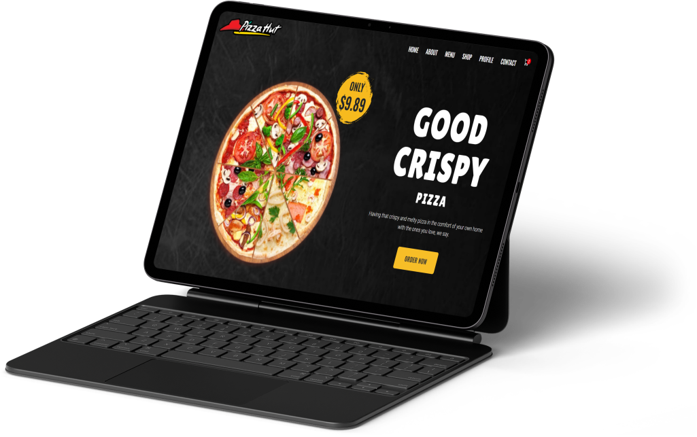

# Food Delivery App

Welcome to the **Food Delivery App** project! This is a web application built with React that allows users to select meals, place orders and track delivery in real-time.

## 🌟 Preview



## 🛠️ The Implementation

### Step 1: Homepage

The homepage (`home.js`) serves as the main entry point for users to browse available restaurants.

```javascript
import React from 'react';
import RestaurantList from './section1'; // Displays restaurants

const Home = () => {
  return (
    <div>
      <h1>Food Delivery</h1>
      <RestaurantList />
    </div>
  );
};

export default Home;
```

### Step 2: Restaurant and Menu Sections

Each section (e.g., `section1.js`, `section2.js`) focuses on specific functionality like listing restaurants, displaying menu items, managing the cart, and viewing order details.

```javascript
// section2.js
import React from 'react';

const RestaurantList = () => {
  return (
    <div>
      <h2>Restaurants Near You</h2>
      {/* Display a list of restaurants */}
    </div>
  );
};

export default RestaurantList;
```

### Step 3: Hero Section with Promotion

```javascript
// section4.js
const Promotion = ({ promotion_section }) => {
  return (
    <div>
      <h2>Promotion Title</h2>
      {/* List items displayed to the screen */}
      <button>Listout</button>
    </div>
  );
};

export default Promotion;
```
### Step 4: Cart Management

In one of the sections (e.g., `section4.js`), users can add items to their cart and view the total before placing an order.

```javascript
// section4.js
const Cart = ({ cartItems }) => {
  return (
    <div>
      <h2>Your Cart</h2>
      {/* List items added to the cart */}
      <button>Checkout</button>
    </div>
  );
};

export default Cart;
```

### Step 5: Adding Contact Section

This section will render a contact section for the users, where they can see the delivery promise and have a call-to-action to place a phone call.

```javascript
// section7.js
const Contact = ({ contact_section }) => {
  return (
    <div>
      <h2>Contact List</h2>
      {/* List items added to the contact */}
      <button>Checkout</button>
    </div>
  );
};

export default Contact;
```